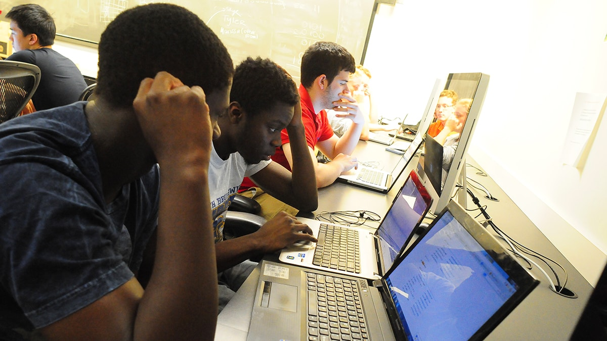

> Most users see a computer at the front and use the graphical user interfaces. The first time I used a computer, it intrigued me to know how these interfaces work, the theory behind computers and the methodology of how they work.

## Why Computer Science?

Logical problem solving has always appealed to me and this explains my interests in mathematics, programming and computing in general. The decision to read computer science was therefore a simple one. My desire for solving challenging problems led to my choices of studying computer science. Solving these problems motivates me and has been my driving tool. Learning new tools, programming languages and frameworks is also very exciting, that's where I get my spark from!

## The Story

We burn the night candles to practise what we have learnt, learn new programming languages, frameworks and tools daily. Yet, we still need to meet up to the academic needs of the department and the school in general. We have to go to class, study all through the day, sit at class for some boring hours. We do have series of assignments to work on and submit. It has not been easy taking care and managing of both parts (the coding part and the academic part), at a time. It demands a lot to be a computer science student and one needs to be very active and ready to face the challenge.

## The Glory

As hectic and tedious as it may look, there is are lots of fun and interesting activities that make computer science a very interesting and importnat course of study. When you write a program that makes lives easier, how do you feel? Very happy righ and motivated! We must not always be a jerk, a nerd nor a Jack (who works all day and never plays). The course of study gives room for fun, enjoyment, social activities and anything worth spending one's time on. Most people believe they cannot enjoy their time and live fun filed lives because they are computer science students, that's not true and never will be

## Conclusion

My experience as a computer science student has been fun filed with a lot of ups and downs, glory, fun and everything good. I never regret being one. I have met great people with great personalities. The lecturers of the department are great, welcoming and always treat us as their family members, which makes learning easier. My colleagues too are very awesome!
