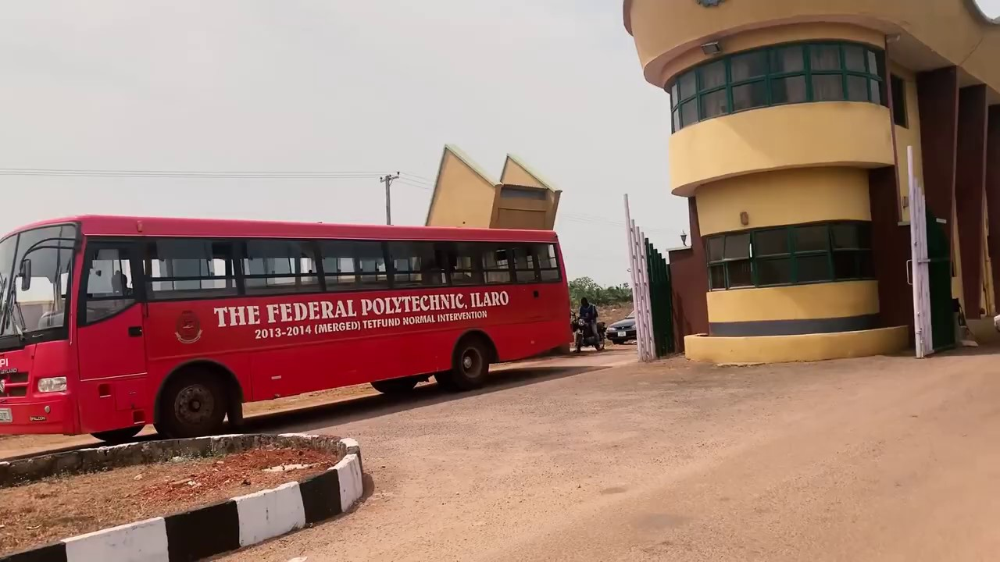

## Let's take a walk to the beginning together!

Looking back to September 2016, when I had just gain my admission into this great institution as a fresh student and a complete stranger to this environment. I came with no plans, all I ever wanted was just to earn my certificate and leave. But as time went on, I started self-teaching myself programming and then my orientation changed. I learn there is more to learn. Being here has taught me a lot of lessons, not just academically, I have learnt more of moral lessons and how to communicate with different people with different backgrounds, different ways of thinking.

I was very excited when I saw my name on the admission list, I left work very early that day and was very glad to break the news to my parents. "Now, I have to stop this hard work at this pure water production factory and proceed on to the next level", thoose were the words I told myself. I was very motivated and happy, not because I want to go and learn, but because, I will be trying a new life entirely. The feelings of living in a new environment, meeting new people was very exciting.

A lot of people had warned me about the school environment, being violent and had adviced me not to proceed with my admission, but I turned deaf ears to their advices, a decision I never regretted. Contradicting to their warnings, the school environment is very peaceful and serene, it's a great place to learn and improve one's skills. There are security agencies at every corner of the school maintaining peace and order of the school. Every student on and off campus is very calm and very peaceful too. It's a very great place to live and learn.

